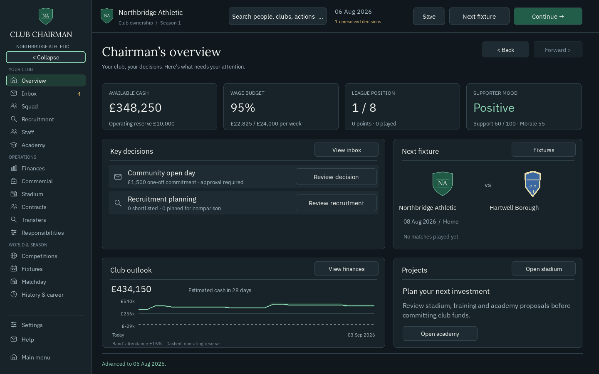
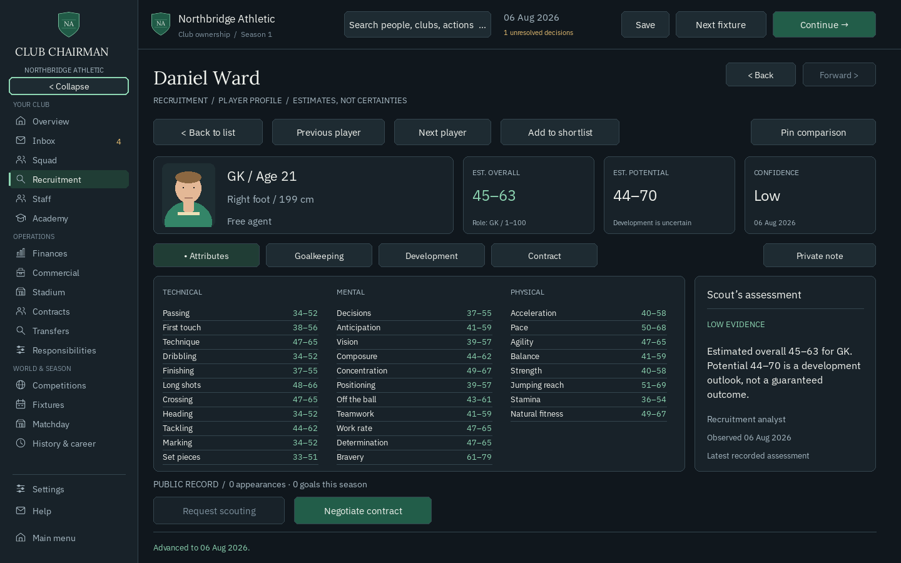

# Figma UI implementation coverage — 0.9

Source: [Club Chairman Figma](https://www.figma.com/design/Q0grGlgTJOhObKeOgWelbo?node-id=21-2), current living GDD revision 0.3, and the existing 0.8 runtime. This is an implementation record, not a replacement design document. The supplied GDD attachment is revision 0.2; the existing design handoff contains the newer revision 0.3, whose relevant UI/QoL sections were consulted. No approved design was removed or changed.

## Runtime mapping

| Figma frame | Runtime route | Implemented coverage and remaining difference |
| --- | --- | --- |
| 00 Main menu, 24 Save manager | Home / Load | New visual composition, latest-valid-save continuation, explicit recovery slots and original-save preservation. Settings is available before a career. |
| 01 Overview | Overview | Live metrics, priority reviews, fixture, forecast and projects. Dashboard arrangement is still pending. |
| 02 Decision centre | Inbox | Split selectable message reader, independent long-text pagination, unread/unresolved distinction and validated decision review. Department filtering, reminder/archive controls remain pending. |
| 03 Squad, 05 Recruitment | Squad / Recruitment | Shared Figma table/field treatment with existing filters, safe sorting, shortlist, comparison, registration and profile routes. Configurable columns and single-click drawers remain pending. |
| 04 Player profile | Player profile | Identity, overall/potential/confidence cards, grouped estimated attributes, evidence source/date and public record. All 37 attributes and existing Development/Contract tabs remain; no invented scouting narrative or hidden truth. |
| 06 Staff, 11 Responsibilities | Staff | Shared typography, panels and actions over the complete existing hiring/delegation workflows. Sidebar responsibility shortcut preserves an existing authority draft. |
| 07 Academy | Academy | Shared visual system over existing trials, admission and development actions. Wider youth pathways remain dependent on simulation work. |
| 08 Finances | Finances | Shared cards, fields and controls; live forecast with labelled currency axis, baseline/scenario, uncertainty band and operating reserve; existing ledger and funding reviews retained. |
| 09 Commercial | Commercial | Existing sponsorship negotiation, conflict checks and signed schedules use the shared visual system. Full demand/pricing layout awaits the corresponding simulation. |
| 10 Stadium, 20/27 Project review | Stadium (Facilities internally) | Existing project proposals, cost reviews, construction and capacity/upkeep effects, shared panels/reviews. Existing procedural stadium illustration retained. |
| 14 Fixtures | Fixtures | Paginated real season schedule with results and read-only reports. Broader calendar/deadline filtering remains pending. |
| 15 Matchday | Matchday | Shared typography, panels, actions and Northbridge crest; existing live engine, commentary, lineups, statistics and bench requests retained. |
| 16 Competitions, 17 History | Competitions / History & career (League / Career internally) | Existing standings, archived seasons and match reports with shared visuals. Expanded competitions/world history depend on simulation work. |
| 19 Settings, 22 UI states | Settings / shared components | Saved zoom, sound, reduced motion, tooltips, keyboard focus and mouse hover; long review pages, disabled controls and empty states. Full accessibility/reflow remains open. |
| 21/28/29 Offer flow | Contracts / Transfers | Existing proposal, counteroffer, financial review and atomic completion workflows retain their behaviours using shared styling. No sample prototype offer is committed as game data. |
| 23 Comparison | Comparison | Existing four-player estimated comparisons and financial scenario routes use shared components. |
| 12 Group, 13 Wealth, 18 Career setup, 25 Content | Future systems | Figma remains the reference. Multi-club ownership, investments, extended setup and content management are not working systems in this build. No nonfunctional menu entries added. |
| 26 Component board | theme.py / UI components | Central token palette, local fonts/assets, shared panels, controls, focus/hover, tables and review components. |

The 1600 × 1000 Figma design is adapted to the established 1440 × 900 logical canvas; existing whole-interface zoom remains. Original fictional identities and live game figures replace the reference’s sample content. Portraits and other clubs’ procedural crests remain existing game assets. No web renderer, React runtime or new runtime dependency was introduced.

## Implementation boundaries

`executive_ui.py` contains the redesigned shell/menu/overview/inbox/fixtures. `theme.py` loads the single Figma token set and packaged fonts. Existing screen mixins use shared controls and retain their command handlers. Presentation uses `view()` snapshots and does not read unrestricted player state. No domain module, RNG, money formula or SQLite schema changed.

Review and inbox pagination are presentation state. Selection and table workspaces retain existing persistence semantics. Confirmation still binds to the revision at which it opened, rejects stale state and cannot run the callback twice. Loading continues to create a separate recovery timeline without rewriting the source save.

## Verification

The existing 102-test suite passed after initial shared-layout integration. Four new input tests cover pre-career settings/latest-save continuation, original-byte preservation, long inbox reading and unresolved approvals, fixture report purity, authority-draft retention and enlarged-keyboard review navigation. All 25 UI/input tests passed on the final runtime, along with the headless source display smoke. Windows/Linux CI and executable results are recorded in the implementation pull request after confirmation. Screenshots are visual evidence of the runtime, not evidence that pending systems exist.

On resuming delivery on 20 September, the complete final suite passed all 106 tests. The two-season / 112-fixture source career self-test, display smoke, dependency check and headless environment checks also passed. These are local source results; Windows executable verification remains a separate release gate.

## Runtime captures

